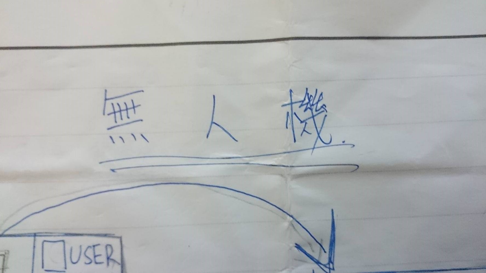
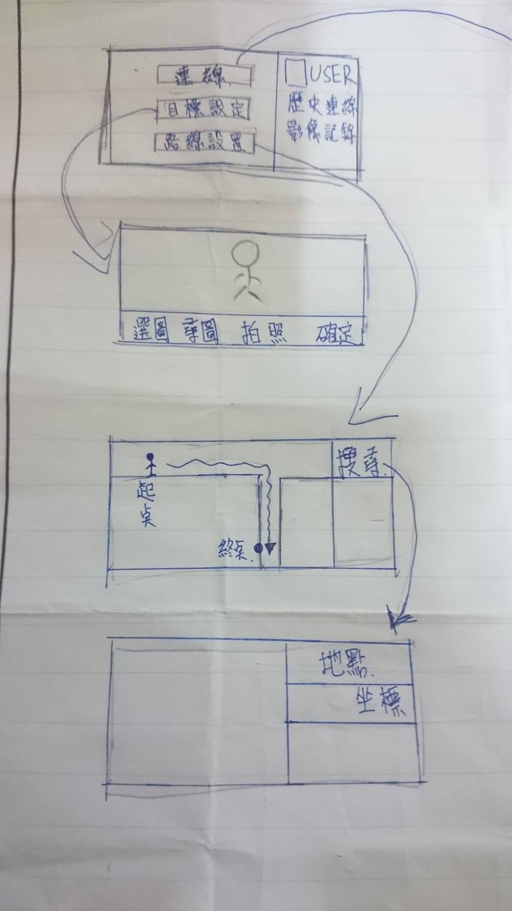
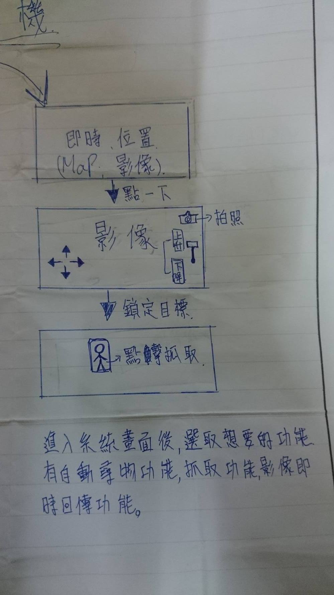
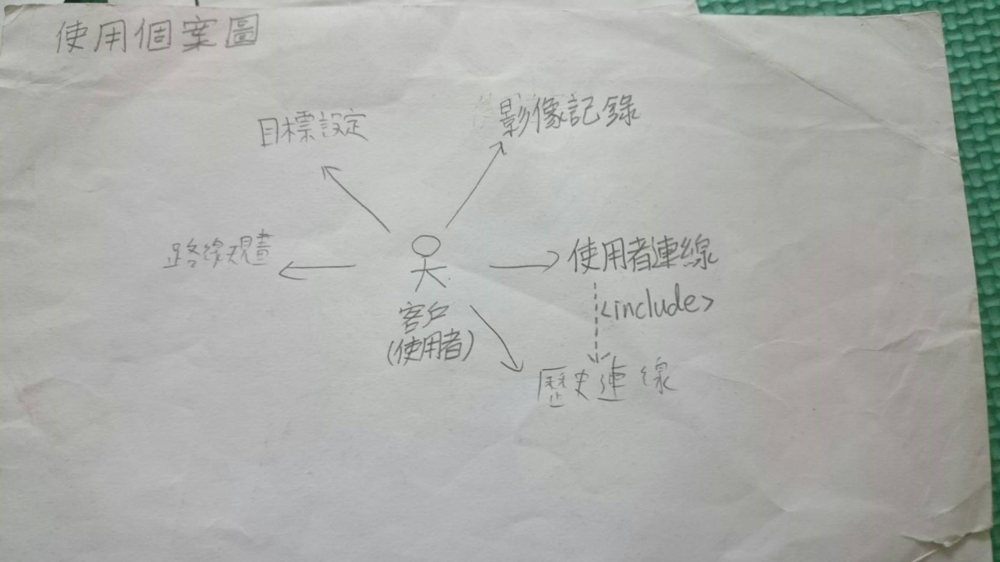
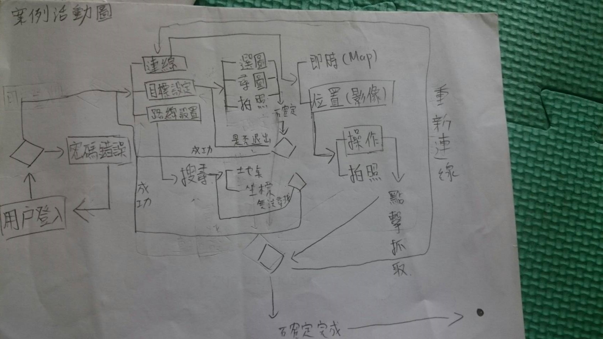
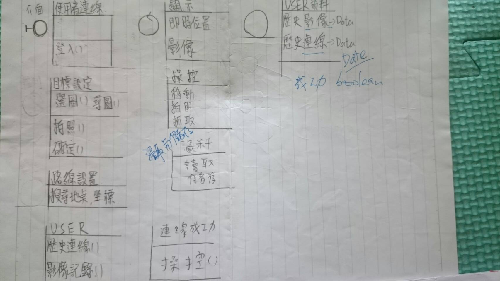
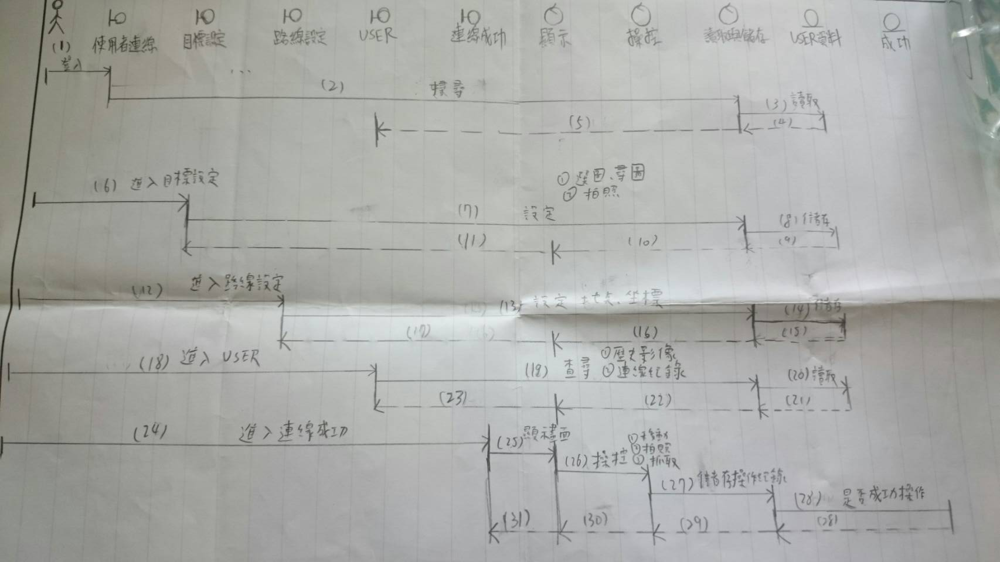
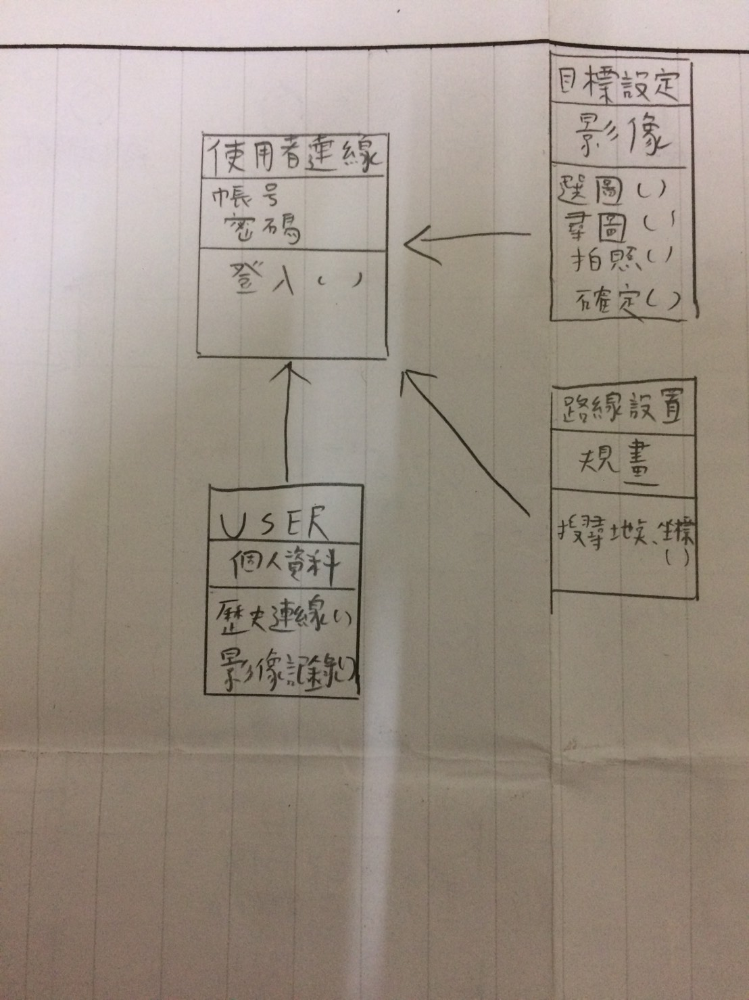

# oose_0324087
|  班級|學號| 姓名 |貢獻| 工作                                         |
|資管3A|87號|凃翰穎|25%|UseCase、案例活動圖、強韌圖、循序圖、類別圖等等...|
|:----:|:--:|:----:|:--:|:-------------------------------------------:|
|資管3A|21號|謝咏宏|25%|UseCase、案例活動圖、強韌圖、循序圖、類別圖等等...|
| -- | -- | -- | -- | -- |
|資管3B|22號|李昰昀|25%|UseCase、案例活動圖、強韌圖、循序圖、類別圖等等...|
| -- | -- | -- | -- | -- |
|資管3B|86號|黃昱嘉|25%|UseCase、案例活動圖、強韌圖、循序圖、類別圖等等...|
| -- | -- | -- | -- | -- |

UseCase

案例活動圖

強韌圖

循序圖

類別圖

